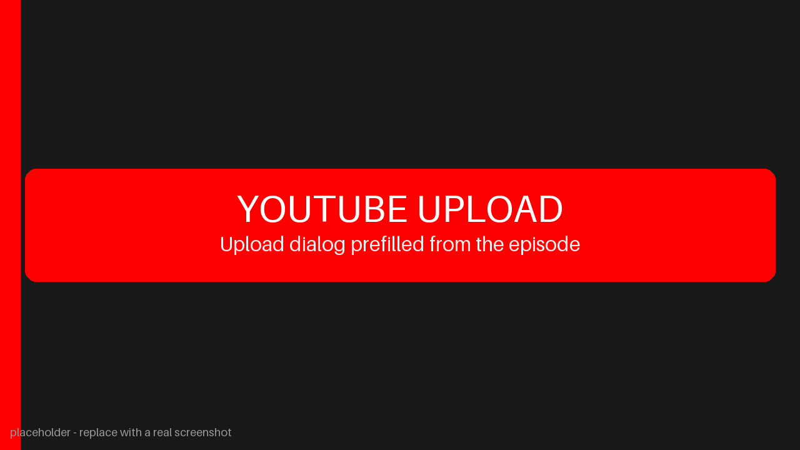
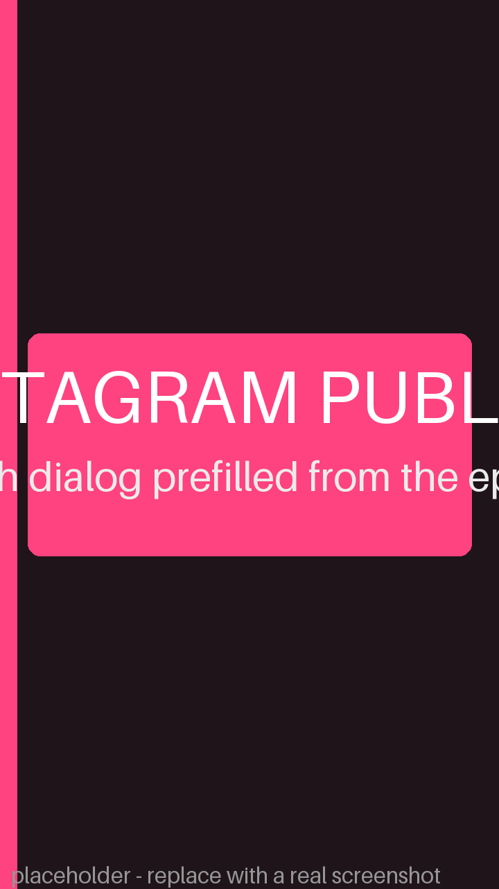

# Your Next Location

A cinematic travel video automation project.

Every Short is one destination — a city, island, coastline, mountain town,
region, or country — shown through beautiful, atmospheric stock footage with
music that fits the place. **No narration, no facts, no subtitles, no
commentary: the destination itself is the content.**

The video opens with a single location caption (`📍 City, Country`) that types
itself on, holds, then retraces off. After that, the footage and music carry
the entire video.

## How it works

The pipeline is config-driven and fully automated:

1. **Prompt stage** — An LLM receives a destination (e.g. `New York City, USA`)
   or chooses one at random, then produces:
   - upload title + summary (metadata only, never shown on screen)
   - a music mood (1–3 keywords like `cinematic`, `lofi`, `tropical`)
   - 14 visual search queries (one per footage segment of the timeline)

2. **Video stage** — Stock footage is fetched from Pexel, licensed music is
   selected from Free Safe Music, and everything is assembled into a vertical
   Short with the location caption animation.

```
Destination → Search footage → Download clips → Select music →
Assemble footage → Add location caption → Mix audio → Export video
```

## Key features

- **Opening location caption**: a single horizontal line (`📍 City, Country`)
  that types left→right, holds, and retraces right→left, then disappears
  within 5 seconds.
- **Cinematic travel footage** from Pexels — skylines, streets, aerials,
  nature, cafes, sunsets, night scenes, etc.
- **Licensed background music** from Free Safe Music (cleared for commercial
  and monetized use on YouTube and Instagram — no attribution required).
- **Vertical Shorts** (1080×1920, 30 fps) with configurable target duration.
- **No narration, no voice, no subtitles.** The destination is the content.

## Quick start

### Prerequisites

- Python 3.12
- FFmpeg
- Google Chrome (for Pexel stock-footage downloads)
- Ollama + `qwen3:8b` model (for destination generation)

### Install

**Windows:**

```bat
setup.bat
```

### Run

**Windows:**

```bat
runner.bat
```

The web UI starts at http://localhost:8000.

### Command line

```bat
.venv\Scripts\activate
python main.py "New York City, USA"
```

Without a destination argument, the AI picks one at random.

## Configuration

All behaviour is driven by JSON files in `config/`:

| File | Purpose |
|------|---------|
| `app.json` | Video resolution, FPS, duration, audio, caption settings |
| `content.json` | Channel description, generation instruction, visual/music rules |
| `pexels.json` | Stock-footage provider settings (search counts, resolution, timeouts) |
| `freesafemusic.json` | Music provider settings (genres, preferred tags, timeouts) |
| `ai_models.json` | LLM model name, temperature, timeout, generation options |
| `youtube.json` | YouTube upload metadata defaults |
| `instagram.json` | Instagram publishing settings |

## Project structure

```
your-next-location/
├── config/              # JSON configuration files
├── ai/                  # LLM content generation (destination + search queries)
│   └── providers/       # LLM backends (Ollama)
├── core/                # Pipeline orchestration
├── production/          # Video assembly
│   ├── footage/         # Stock-footage providers (Pexel)
│   ├── music/           # Music providers (Free Safe Music)
│   ├── composer.py      # Assembles footage + caption + music into a Short
│   ├── captions.py      # Opening 📍 location caption animation
│   └── video.py         # ProductionPipeline: fetches footage/music, renders
├── web/                 # Web UI + HTTP API server
├── youtube/             # YouTube upload + metadata
├── instagram/           # Instagram publishing
├── media/               # Generated output (ignored by git)
└── tests/               # Smoke tests
```

---

# 📺 YouTube Uploads

Completed episodes can be uploaded directly from the web UI. Each episode card with a finished `episode.mp4` includes an **Upload to YouTube** button that opens a metadata and authentication modal.




### Upload metadata

The modal allows the following video fields to be reviewed and changed before upload:

* **Channel Name** — human-readable channel name. The server resolves this through the authenticated Google account using `channels.list(mine=true)` and refuses missing, unmatched, or ambiguous names.

* **Title** — prefilled from the `TITLE:` value in the episode's `prompt.txt`.

* **Description** — prefilled from the episode `TITLE:` and short `SUMMARY:` (not the long generation prompt), followed by default hashtags from `config/youtube.json`.

* **Tags** — comma-separated YouTube tags.

* **Category ID** — YouTube's numeric category identifier. The default is `24` (Entertainment).

* **Privacy Status** — `private`, `unlisted`, or `public`.

* **Made for Kids** — controls the corresponding YouTube audience declaration.

### OAuth credentials

The account section contains only the values needed for OAuth authentication:

* OAuth Client ID
* OAuth Client Secret
* Refresh Token

Credentials are loaded from `.env` using these keys:

```env
youtube_client_id=YOUR_CLIENT_ID
youtube_client_secret=YOUR_CLIENT_SECRET
youtube_refresh_token=YOUR_REFRESH_TOKEN
```

Uppercase variants (`YOUTUBE_CLIENT_ID`, `YOUTUBE_CLIENT_SECRET`, and `YOUTUBE_REFRESH_TOKEN`) are also supported. Environment values override the corresponding values in `config/youtube.json`, allowing that JSON file to contain only non-secret defaults such as `channel_name`.

The token helper reads the client ID and client secret from `config/youtube.json` (or `.env`) automatically, opens Google's consent screen, and writes the resulting refresh token back to `.env`:

```powershell
python -m youtube.refresh_token
```

The OAuth flow requires both `youtube.upload` and `youtube.readonly` scopes. The readonly scope is used to resolve and verify the human-readable Channel Name before uploading. If an existing refresh token was created without that scope, run the helper again and approve the additional permission.

### Upload process

The backend exchanges the refresh token for a temporary access token, verifies the requested channel, and uploads the MP4 through the YouTube Data API v3 resumable upload protocol. Access tokens expire after approximately one hour; they are regenerated automatically and do not need to be stored manually.

For Google accounts managing multiple Brand channels, authorize the intended channel/account context and test the first upload with `private` visibility. YouTube's standard `videos.insert` endpoint does not provide a normal target-channel parameter, so the application rejects channel-name mismatches instead of guessing.

# 📸 Instagram Uploads

Completed episodes can also be published as Instagram **Reels** directly from the web UI. Each episode card with a finished `episode.mp4` includes an **Upload to Instagram** button next to the YouTube button.



## Modal fields

The form keeps only what is required:

**Account** (prefilled from `.env`, editable per publish):

* **Access Token** — long-lived Instagram API token (~60 days)
* **Instagram User ID** — numeric ID of the Instagram professional account

**Post:**

* **Caption** — prefilled as `TITLE` + `SUMMARY` + default hashtags from `config/instagram.json`, fully editable

## Public URL requirement

Instagram's servers fetch the video themselves, so publishing requires a **publicly reachable HTTPS URL** for the episode MP4. The application derives it automatically from however you are browsing the UI:

* Locally: run `runner.bat` with cloudflared installed — the script auto-starts a quick tunnel and prints the public URL. Browse the app through that URL.
* On RunPod: expose port 8000 as an HTTP port and browse through the provided `https://<pod-id>-8000.proxy.runpod.net` URL.

If the derived host is `localhost`, the server logs a warning and publish failures include the exact unreachable URL for diagnosis.

## Credentials and token refresh

Credentials live only in `.env` (never in JSON config):

```env
instagram_access_token=...
instagram_user_id=...
```

Optional, only needed when `config/instagram.json` points at `graph.facebook.com` instead of the default `graph.instagram.com`:

```env
instagram_app_id=...
instagram_app_secret=...
```

Refresh the ~60-day token before it expires — no arguments needed:

```powershell
python -m instagram.refresh_token
```

The helper exchanges the current still-valid token via the appropriate grant (`ig_refresh_token` on `graph.instagram.com`, `fb_exchange_token` on `graph.facebook.com`) and writes the new token back to `.env` automatically.

## Publish process

The backend validates the account, builds the public video URL, then follows Instagram's container flow: create a media container pointing at the video URL → poll until Meta finishes processing → publish the container → resolve the post permalink. Processing can take a few minutes; keep both the server and tunnel/proxy alive until it completes.

## Upload tracking

Every episode folder can contain an `upload.txt` file recording which
platforms the episode has been published to:

```text
youtube=true
instagram=false
```

The web UI keeps this file in sync automatically:

* A successful YouTube or Instagram upload marks that platform as done.
* Each upload modal includes a **"Mark as Done"** toggle for manually
  marking (or unmarking) a platform.
* Uploaded platforms show a green checkmark on the episode card buttons.

---

## License

The generated videos use:

- Stock footage from Pexels (CC0 / Pexels license)
- Background music from Free Safe Music (commercial-use cleared, no attribution required)
